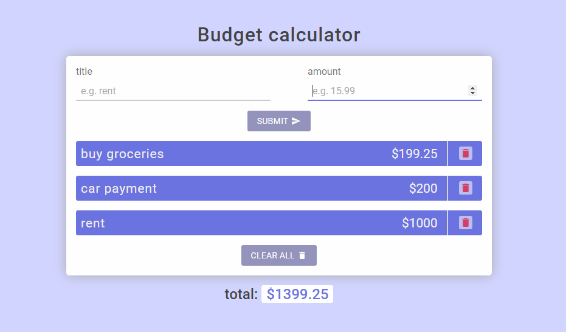

  
  <h1>Expenses calculator <a href="https://mohammadbaratii.github.io/Reactjs-Expenses-calculator/">(watch online)</a></h1>
  

    I made it <strong>based on</strong>
    <a
      href="https://www.youtube.com/watch?v=f6HYLHrYpGs&list=PLgMICEduGwEzy6jqbR_yciKiGDsto74Dq"
      >Coding Addict
    </a>
    tutorial, but i didn't just copy and paste the codes.
  

    

    Edit the codes and let me know if you have more knowledge or better ideas.
    

  
In the project directory, you can run:

  <pre>npm start</pre>
  

    It runs the app in the development mode. Open
    <a href="http://localhost:3000">http://localhost:3000</a> to view it in the
    browser.
  

  

    The page will reload if you make edits. You will also see any lint errors in
    the console.
  

